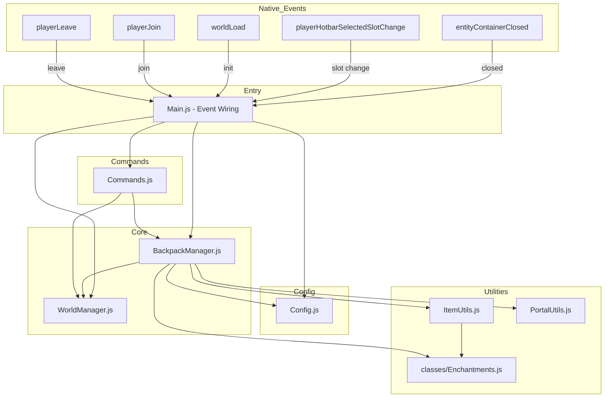

# Improved Backpacks — Script Refactoring Plan

## Current Architecture

```
src/
├── Main.js              (701 lines) — Monolithic: lifecycle, commands, portal detection, item handling
├── CustomListeners.js   (86 lines)  — 3 custom event-like classes (1 unused)
├── players.js           (54 lines)  — Player manager class (UNUSED — dead code)
├── WorldManager.js      (64 lines)  — Singleton: player & backpack entity tracking
└── classes/
    └── Enchantments.js  (90 lines)  — Static enchantment utilities
```

`esbuild.js` bundles `src/Main.js` → `scripts/Main.js` (minified).

---

## Identified Problems

### 🔴 Bugs
| # | Issue | Location | Context7 Validation |
|---|-------|----------|---------------------|
| B1 | **DOUBLE BUG:** `restartBackpackAddon()` calls `itemChangeEvent.unsubscribe()` but: **(a)** the `.subscribe()` return value was never captured into `itemChangeEvent`, AND **(b)** the unsubscribe pattern is wrong — `.subscribe()` returns a callback function, not an object with `.unsubscribe()`. The correct API is `signal.unsubscribe(callback)`. | `src/Main.js:183,57` | ✅ Confirmed via `@minecraft/server` docs: `.subscribe()` returns `(arg) => void`, unsubscribe via `signal.unsubscribe(callback)` |
| B2 | `closeBackpack()` always teleports to `y = -64` (only correct for Overworld). The inactive-backpack loop uses dimension-aware offsets but `closeBackpack` hardcodes Overworld. Causes inconsistent behavior in Nether/End. | `src/Main.js:584-588` | N/A — logic bug |

### 🟡 Unused / Dead Code
| # | Issue | Location |
|---|-------|----------|
| D1 | `players.js` — entire file is imported nowhere. `playerManager` is never used. `WorldManager` handles all player tracking. | `src/players.js` |
| D2 | `MainHandItemChange` class in `CustomListeners.js` — marked "Not Being Use", never instantiated. | `src/CustomListeners.js:5-32` |
| D3 | `BackpackCache` array — declared at module level, never populated or read. | `src/Main.js:15` |

### 🟠 Design Issues
| # | Issue | Location |
|---|-------|----------|
| S1 | **Monolithic 700-line file** — Main.js handles everything: commands (12 cases), lifecycle, portal detection, item serialization, dimension iteration. | `src/Main.js` |
| S2 | **Duplicate dimension iteration** — `getBackpackEntity()` (line 513) and `WorldManager.updateAllBackpacks()` (line 14) both iterate all 3 dimensions to find entities. | `src/Main.js:513-523`, `src/WorldManager.js:14-23` |
| S3 | **Duplicate switch statements** — `backpackType()` and `backpackName()` are nearly identical (4 cases each mapping typeId → type/name). Should be a config map. | `src/Main.js:485-511` |
| S4 | **Hardcoded dimension offsets** — `OVERWORLD_Y_OFFSET`, `NETHER_Y_OFFSET`, `END_Y_OFFSET` as separate consts instead of a dimension→offset map. | `src/Main.js:10-12` |
| S5 | **Variable declaration inconsistency** — Mix of `var`, `let`, `const`. Commands function uses `var` extensively. | `src/Main.js:253-468` |
| S6 | **Stringly-typed backpack types** — `"small"`, `"medium"`, `"big"`, `"xl"` scattered across code without a shared enum/constant. | Multiple files |
| S7 | **Repeated OP-check + entity-query pattern** — 7 commands repeat: check `isPlayerOP` → query entities by tag → iterate. | `src/Main.js:253-468` |
| S8 | **Empty catch blocks** — `checkForNearbyPortal` and parts of `openBackpack` silently swallow errors. | `src/Main.js:175,547-549` |
| S9 | **Hardcoded OP check** — `isPlayerOP` is always `true` with the actual check commented out. | `src/Main.js:255` |
| S10 | **Triple nameTag timeout** — 3 separate `system.runTimeout()` calls at 1, 5, 20 ticks to re-apply backpack name. Hacky workaround. | `src/Main.js:556-570` |

---

## Proposed Architecture

```
new scripts/
├── Main.js                  (~100 lines) — Entry point: event wiring, initialization
├── Config.js                (~45 lines)  — All constants, backpack type map, dimension offsets
├── Commands.js              (~250 lines) — Command handler (extracted from Main.js)
├── BackpackManager.js       (~350 lines) — Backpack lifecycle + event handlers
├── ItemUtils.js             (~80 lines)  — Forbidden items, lore formatting, serialization
├── PortalUtils.js           (~30 lines)  — Portal proximity detection
├── WorldManager.js          (~70 lines)  — Refactored: unified entity queries
└── classes/
    └── Enchantments.js      (unchanged)  — Static enchantment utilities
```

**Removed files:** `CustomListeners.js` (replaced by native events), `players.js` (dead code)

### Module Responsibilities

| Module | Responsibility |
|--------|---------------|
| **Main.js** | Top-level wiring: subscribe to `entityContainerClosed`, `playerHotbarSelectedSlotChange`, `worldLoad`, `playerJoin`, `playerLeave`, `scriptEventReceive`. Thin orchestrator — **zero polling intervals**. |
| **Config.js** | All constants: `DIMENSION_OFFSETS`, `BACKPACK_TYPES` (unified map), `FORBIDDEN_ITEMS`, `BACKPACK_TELEPORT_HEIGHT`, `BACKPACK_FAMILY`. |
| **Commands.js** | `handleCommand(message, sender)` — parses and dispatches all `!bps` subcommands. Uses `requireOP()` and `findBackpackById()` helpers. |
| **BackpackManager.js** | `createBackpack()`, `openBackpack()`, `onBackpackClosed()` (replaces BackpackClosing polling), `recordItems()`, `recoverItems()`, `transferItems()`, `getBackpackEntity()`, `teleportBackpackToPlayer()`. |
| **ItemUtils.js** | `isForbiddenItem()`, `formatItemForLore()`, `getItemProperties()`, `handleForbiddenItems()`. |
| **PortalUtils.js** | `checkForNearbyPortal(dimension, location)` — extracted with proper error handling. |
| **WorldManager.js** | Refactored: unified `getEntitiesAcrossDimensions(query)`, player tracking, backpack tracking. |
| **Enchantments.js** | No structural changes needed. Well-written static utility class. |

---

## Detailed Changes

### 1. Config.js — Consolidate Constants
```js
export const DIMENSION_OFFSETS = {
    'minecraft:overworld': -64,
    'minecraft:nether': 0,
    'minecraft:the_end': 0,
};

export const BACKPACK_TYPES = {
    'bps:backpack':        { size: 'small',  name: 'Small Backpack' },
    'bps:backpack_medium': { size: 'medium', name: 'Medium Backpack' },
    'bps:backpack_big':    { size: 'big',    name: 'Big Backpack' },
    'bps:backpack_xl':     { size: 'xl',     name: 'XL Backpack' },
};

export const FORBIDDEN_ITEMS = ['bps:', 'shulker_box', 'bundle'];
export const BACKPACK_TELEPORT_HEIGHT = 1.5;
export const DIMENSION_LIST = ['minecraft:overworld', 'minecraft:nether', 'minecraft:the_end'];
```

Replaces: `backpackType()`, `backpackName()`, `forbiddentItems`, separate offset constants, `DimensionList`.

### 2. Commands.js — Extract Command Handler
- Move the entire `commands()` function + `commandList()` from Main.js
- Add helper: `requireOP(sender)` — DRY the OP check
- Add helper: `findBackpackById(id)` — DRY the "query by tag: bps_id:X" pattern
- Convert all `var` → `const`/`let`
- Export `handleCommand(message, sender)`

### 3. BackpackManager.js — Backpack Lifecycle
- `createBackpack(player, item, bpId)` — extracted from `onChanged` "Create New Backpack ID" branch
- `openBackpack(player, bpItem)` — moved from Main.js, uses `BACKPACK_TYPES` from Config
- `closeBackpack(bpEntity)` — **FIXED** to use `DIMENSION_OFFSETS` instead of hardcoded `-64`
- `recordItems(id, inventory, bpEntity)` — moved, uses `ItemUtils`
- `recoverItems(player, id)` — moved, uses `ItemUtils`
- `transferItems(sourceInv, targetInv)` — moved
- `getBackpackEntity(query)` — moved, delegates to `WorldManager` for dimension iteration

### 4. ItemUtils.js — Item Helpers
- `isForbiddenItem(item)` — from Main.js
- `formatItemForLore(item)` — from Main.js
- `getItemProperties(item)` — from Main.js (uses Enchantments)
- `handleForbiddenItems(inventory, location, dimension)` — from Main.js

### 5. PortalUtils.js — Portal Detection
- `checkForNearbyPortal(dimension, location)` — extracted with:
  - Proper error handling (log warning instead of empty catch)
  - Uses a `const` block list defined outside the function

### 6. WorldManager.js — Refinements
- Add `getEntitiesAcrossDimensions(query)` — unified dimension iteration (used by both `updateAllBackpacks` and `getBackpackEntity`)
- Remove unused methods (if any found after analysis)
- Keep existing `addPlayer`/`removePlayer`/`getAllPlayers`/`getAllBackpacks`/`getBackpacksWithTag`

### 7. CustomListeners.js → **DELETED** — Replaced by Native Events

#### Current (Polling-based, wasteful):
- `PlayerHoldingBackpack` runs `system.runInterval` every tick, iterating all tracked players, checking if they hold a backpack, teleporting backpack entity
- `BackpackClosing` runs `system.runInterval` every tick, polling all backpacks for a "close" tag set by entity JSON entity_sensor

#### Replacement (Event-driven, zero polling):
- **`world.afterEvents.entityContainerClosed`** — native event fires when ANY entity container is closed. Filter by backpack entity type/family. Event provides:
  - `event.entity` — the backpack entity whose container was closed
  - `event.closeSource` — `{ entity: Player }` — the player who closed it
  - Supports `EntityContainerAccessEventOptions` for pre-filtering by entity type
- **Teleport on hotbar change** — instead of polling every tick, teleport the backpack entity once when the player switches to a backpack item (already captured in `playerHotbarSelectedSlotChange`)

#### Benefits:
| Metric | Before (Polling) | After (Native Events) |
|--------|------------------|-----------------------|
| Tick loops | 2 system.runInterval | 0 |
| Entity iteration/tick | All players + all backpacks | 0 (event-driven) |
| Close detection delay | Up to 1 tick | Instant (native event) |
| CustomListeners.js | 86 lines | 0 lines (file deleted) |

### 8. Main.js — Thin Orchestrator
After extraction, Main.js becomes ~100 lines:
```js
import { world, system } from '@minecraft/server';
import { BACKPACK_FAMILY } from './Config.js';
import { handleCommand } from './Commands.js';
import BackpackManager from './BackpackManager.js';
import WorldManager from './WorldManager.js';

// Native event: backpack container closed
world.afterEvents.entityContainerClosed.subscribe((event) => {
    if (!event.entity?.hasTag(BACKPACK_FAMILY)) return;
    BackpackManager.onBackpackClosed(event.entity, event.closeSource?.entity);
}, { entityFilter: { families: [BACKPACK_FAMILY] } });

// Hotbar change → backpack lifecycle + teleport
world.afterEvents.playerHotbarSelectedSlotChange.subscribe((eventData) => {
    // ... teleport backpack entity when holding one
    // ... onChanged lifecycle (create/open/close)
});

// ... worldLoad, playerJoin, playerLeave, scriptEventReceive
// ... BackpackMain() initialization
```

### 9. Bug Fixes
- **B1**: Capture `world.afterEvents.playerHotbarSelectedSlotChange.subscribe()` return value as `itemChangeEvent` so `restartBackpackAddon()` can unsubscribe properly.
- **B2**: `closeBackpack()` uses `DIMENSION_OFFSETS[dimension.id]` instead of hardcoded `-64`.
- Remove `players.js` entirely.
- Remove `BackpackCache` unused array.
- Add `console.warn()` in previously-empty catch blocks for debuggability.

### 10. esbuild.js — Update Entry Point
```js
entryPoints: ['new scripts/Main.js'],
outfile: 'scripts/Main.js',
```
Or keep entry pointing at `src/Main.js` if the user wants the refactored code to replace the src folder. **Decision**: Write to `new scripts/` as requested, and update esbuild to point there.

---

## Files to Write (new scripts/)

| File | Source Lines | New Lines |
|------|-------------|-----------|
| `Main.js` | 701 | ~100 |
| `Config.js` | NEW | ~45 |
| `Commands.js` | NEW | ~250 |
| `BackpackManager.js` | NEW | ~350 |
| `ItemUtils.js` | NEW | ~80 |
| `PortalUtils.js` | NEW | ~30 |
| `WorldManager.js` | 64 | ~70 |
| `classes/Enchantments.js` | 90 | 90 (copy) |
| **TOTAL** | ~855 | ~1015 |

**Removed from output:** `CustomListeners.js` (86 lines → 0, replaced by native events), `players.js` (54 lines of dead code).
The slight increase in total lines is due to proper JSDoc comments, spacing, and imports — but each file is focused, testable, and the overall system is simpler (no polling loops).

---

## Data Flow Diagram



**Key change:** `CustomListeners.js` (polling-based) is replaced by native `world.afterEvents` signals — zero `system.runInterval` tick loops remain.

---

## API Validation Summary (via Context7)

All API patterns used in the codebase were cross-referenced against the official [`@minecraft/server`](https://learn.microsoft.com/en-us/minecraft/creator/scriptapi/minecraft/server/minecraft-server) documentation:

| API Used | Status | Notes |
|----------|--------|-------|
| `world.afterEvents.*.subscribe()` → returns callback | ✅ Valid | Correct pattern: capture return value, pass to `signal.unsubscribe(callback)` |
| `world.getDynamicProperty()` / `world.setDynamicProperty()` | ✅ Valid | String values supported; JSON serialization is standard practice |
| `entity.getComponent("inventory").container` | ✅ Valid | Standard inventory access pattern |
| `ItemStack.getLore()` / `ItemStack.setLore()` | ✅ Valid | Returns/sets `string[]` |
| `ItemStack.getComponent("durability").damage` | ✅ Valid | Get/set durability damage value |
| `EnchantmentTypes.get(id)` → `EnchantmentType` | ✅ Valid | Accepts full ID like `"minecraft:sharpness"` |
| `ItemEnchantableComponent.addEnchantment()` | ✅ Valid | Accepts `{ type: EnchantmentType \| string, level: number }` |
| `Dimension.getEntities(query)` | ✅ Valid | Supports `type`, `tags`, `families`, `closest`, `location`, `maxDistance` filters |
| `Dimension.spawnEntity(typeId, location)` | ✅ Valid | Spawns entity, returns spawned entity reference |
| `Entity.teleport(location)` | ✅ Valid | Teleports within same dimension |
| `Entity.triggerEvent(eventName)` | ✅ Valid | Triggers entity events defined in JSON |
| `system.runInterval()` / `system.clearRun()` | ✅ Valid | Returns numeric handle for cleanup |
| `system.runTimeout()` | ✅ Valid | Delayed single execution |
| `world.afterEvents.entityContainerClosed` | ✅ Valid | Native event; provides `event.entity` + `event.closeSource`; supports `EntityContainerAccessEventOptions` entity filter |
| `world.afterEvents.entityContainerOpened` | ✅ Valid | Native event; fires when entity container opens; supports same filter options |

---

## Out of Scope (Not Changing)
- Entity JSON files (backpack_container.json, etc.) — these are data, not scripts
- Item/recipe JSON files
- Animation controllers
- MCfunction files
- The `Enchantments.js` class — already well-structured
- The minification/esbuild setup — only updating the entry point path
